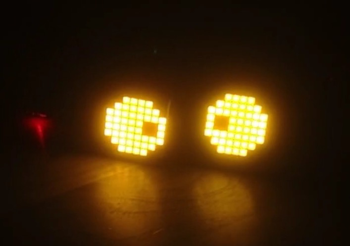
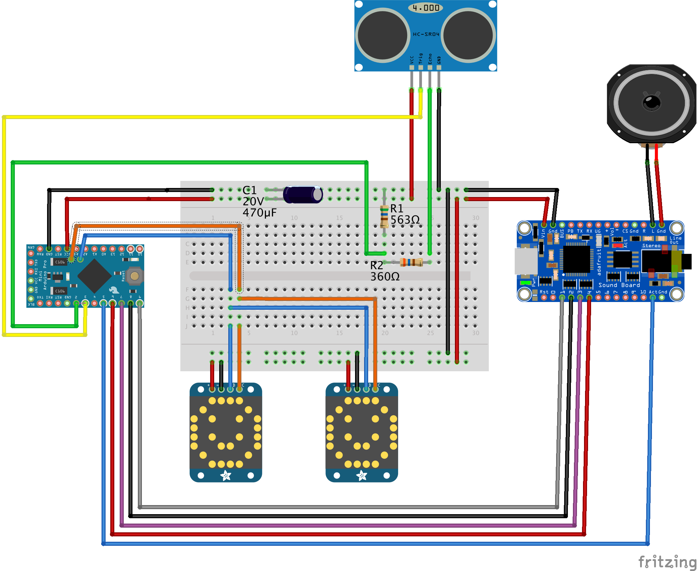
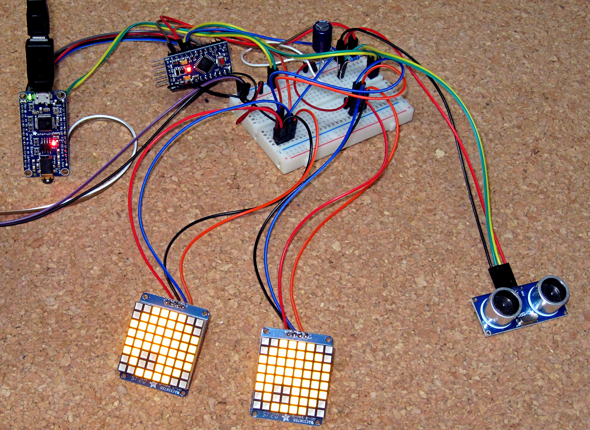
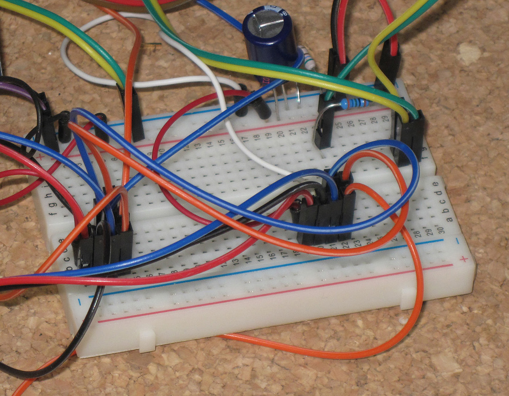

ScareOS Halloween Pumpkin thingy
================================

Muhahahaha! Aaaaargh! Trick or Treat. Be so sweet. Give me something good to eat.

I wanted to build something cool and scary for Halloween. Here in Germany Helloween is just about to become a trend. Meet the ScareOS, a thingy to spice up Halloween.

**Features**

* Moving eyes (object tracking perhaps in version 2 - have to figure out how to integrate motion tracking)
* Discovers if someone is around by using a ranging sensor
* Plays Halloween sounds when it's awake
* Sleep state if no one is around for a while
* Whines when someone comes too close

ScareOS is an Arduino-based thingy with eyes, sound and a range sensor. ScareOS tends to be sleepy. It there's no one around, it sleeps and snores. As soon as someone comes into range, it awakens. Then the thingy looks at its visitor, triggers a series of Halloween sounds and, moves its eyes. But beware! It starts to cry like a baby when you approach too close.



The components are not yet built into a Pumpkin, but they are ready to go. I'll provide pictures on Oct 31, once I got the pumpkin set up.


**Youtube Videos**

<a href="http://www.youtube.com/watch?feature=player_embedded&v=ZoHyhjCuUWQ
" target="_blank"></a>

<a href="http://www.youtube.com/watch?feature=player_embedded&v=dUIu-4qToRM
" target="_blank"></a>

*Hint: The video interferences are some recording issues.*

Ingredients
-----
You'll need:

* 1x Arduino (I used the [Ardunino Mini Pro](http://www.adafruit.com/products/2378) because of its form factor)
* 1x [Ultrasonic HC-SR04 Ranging Sensor](http://www.amazon.com/SainSmart-HC-SR04-Ranging-Detector-Distance/dp/B004U8TOE6)
* 2x [8X8 LED Matrix with I2C Backpack](http://www.adafruit.com/products/1050)
* 1x [Audio FX Sound Board - WAV/OGG Trigger with 2MB Flash](http://www.adafruit.com/products/2133)
* 1x 470µF Capacitor
* 1x 470Ω - 560Ω Resistor
* 1x 330Ω - 360Ω Resistor
* a [whole bunch](http://www.adafruit.com/products/826) of wire connectors
* 1x [Speaker](http://www.adafruit.com/products/1314)
* 1x [Breadboard](http://www.adafruit.com/products/64) (or a circuit board)

Once you have all parts together, you can start wiring them.

Wiring
------
The common ground and common `VCC` of the breadboard comes handy to provide current for the involved components. The diagram shows you how to connect the particular components.



The two resistors protect the circuit from a signal that won't come back. I originally built the ranging sensor circuit on RaspberryPi and took kept the design. The Arduino `pulseIn()` function also accepts a timeout so basically the circuit would work without the resistors.

The capacitor stabilizes the circuit. I discovered that the LED matrices cause some interference and instabilities within the `VCC`. The effect: The ranging sensor works only until some 80cm once both LED matrices are turned on. If the matrices are switched off or do not display anything, the ranging sensor works fine. My solution: Connect a capacitor to `GND` and `VCC`.





Sounds
------
Once all parts are connected, upload the sounds from the `sounds` folder to the soundboard. Connect the soundboard to a USB port and copy all files to the flash disk using your favorite file copy tool.

There are four sounds/categories of sounds:

1. T01 Wake-up sound: Played once the ScareOS awakes from the sleep state
2. T02RANDnn sounds: Collection of sounds that are played randomly in the awake state. Therefore, the special suffix `RAND00` to `RAND99`
3. T03 sound: Whining/crying if someone approaches in the near zone of the device
4. T04HOLDL: Snoring sound, plays as long as the trigger is held, therefore, the special suffix `HOLDL`


Arduino Sketch
--------------

You need some code to run ScareOS. The code controls the components and handles wake/sleep, triggering sounds and displaying the eyes on the LED matrix.

The code is located in `scare-os/scare-os.ino`. You need two additional libraries:

* [Adafruit-LED-Backpack-Library](https://github.com/adafruit/Adafruit-LED-Backpack-Library)
* [Adafruit-GFX-Library](https://github.com/adafruit/Adafruit-GFX-Library)

The Adafruit site has a nice tutorial how to [install Arduino libraries](https://learn.adafruit.com/adafruit-all-about-arduino-libraries-install-use/arduino-libraries).

So open the Sketch, compile it and upload it to your Arduino.

You can adopt the code to use different pins or adjust the distance/timing:

```arduino
#define PIN_SONIC_TRIGGER 3
#define PIN_SONIC_ECHO 2

#define PIN_SND_TRIGGER_WAKE 9
#define PIN_SND_TRIGGER_REGULAR 8
#define PIN_SND_TRIGGER_NEAR 7
#define PIN_SND_TRIGGER_SLEEPING 6
#define PIN_SND_ACTIVE  5

// ms
#define SOUND_INTERVAL_MS 20000
#define WAKE_DURATION_MS 180000

#define ACTIVATION_DISTANCE_CM 280
#define NEAR_DISTANCE_CM 100
```

### Threading with Arduino

Arduino code runs only single-threaded, meaning your Arduino can do only one thing at a time. The sound trigger module, for instance, does not occupy the Arduino once a sound plays. So sounds play in the background within this terminology. Why am I telling you that? 

Displaying and animating graphics, like it is done with the matrix eyes, requires the Arduino to execute code, sleep a while, then execute code again and so on. One animation cycle lasts between 0.5sec and 10sec. In this time, the Arduino is occupied with the animation. If someone walks by the range sensor really fast, we would not notice it, because we're occupied with animating and not with measuring distance. 

But that's not fully true. Most of the time, the Arduino "sleeps" which means we could use that time to do different things - things like triggering a sound or measuring distance. The code is written to utilize these delays. You'll find lots of calls to a `bgProcessing()` method. This method is called with a delay parameter. If the delay is long enough to measure the distance (measuring the distance needs time and triggering sound, too), the distance is measured and the sound processing is invoked there. It's not exactly a task scheduler like a Windows or MacOS use to emulate multi-threading on one CPU (core), but it interleaves tasks in a similar way.

### Some words about measuring distance

The ranging sensor uses the physics of [speed of sound](https://en.wikipedia.org/wiki/Speed_of_sound) to determine the distance. An ultrasonic sound is triggered and the microphone records the echo. The speed of sound in dry air is about one kilometer in 2.914 sec. Since the sound needs to hit an object that bounces it back, the way is crossed twice. This means, that the duration to measure the distance is `DISTANCE * Speed of Sound * 2`.

Sometimes, the ranging sensor reports an echo after a shorer or longer time. The result of that are flickering distances of up to 100cm. These are outliers and falsify the result (the assumption of distance). The code, therefore, performs a series of measures, sorts the results and takes some middle result. It works pretty good and the implementation is quite simple (easier than calculating a quantile).

And now, it's time to scare:

<a href="http://www.youtube.com/watch?feature=player_embedded&v=ZoHyhjCuUWQ
" target="_blank"></a>


Attribution
-----------
I used following sound effects that require attribution:

* http://soundbible.com/1363-Angry-Cat.html
* http://soundbible.com/1939-Bats-In-Cave.html
* http://soundbible.com/2038-Demon-Girls-Mockingbird.html
* http://soundbible.com/1627-Female-Scream-Horror.html
* http://soundbible.com/1738-Little-Demon-Girl-Song.html
* http://soundbible.com/1828-Poltergeist.html
* http://soundbible.com/1918-Sick-Villain.html
* http://soundbible.com/766-Slow-Breathing.html
* http://soundbible.com/2016-Thunder-Strike-2.html

License
-----------
<a rel="license" href="http://creativecommons.org/licenses/by/4.0/"></a><br /><span xmlns:dct="http://purl.org/dc/terms/" property="dct:title">ScareOS</span> by <a xmlns:cc="http://creativecommons.org/ns#" href="https://github.com/mp911de/scare-os-halloween-iot" property="cc:attributionName" rel="cc:attributionURL">https://github.com/mp911de/scare-os-halloween-iot</a> is licensed under a <a rel="license" href="http://creativecommons.org/licenses/by/4.0/">Creative Commons Attribution 4.0 International License</a>.<br />Based on a work at <a xmlns:dct="http://purl.org/dc/terms/" href="https://github.com/mp911de/scare-os-halloween-iot" rel="dct:source">https://github.com/mp911de/scare-os-halloween-iot</a>.